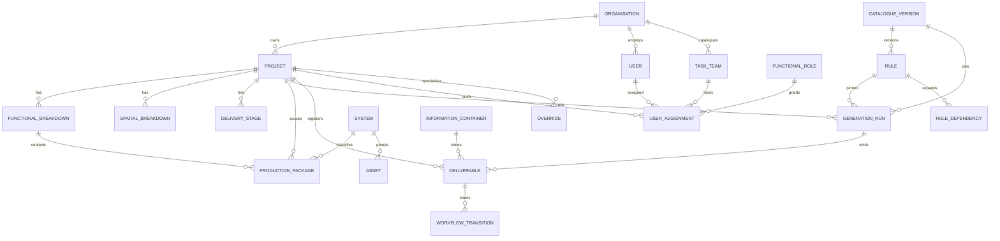
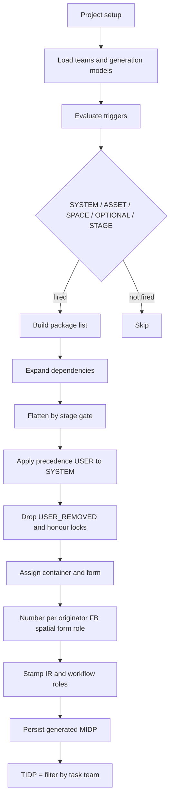
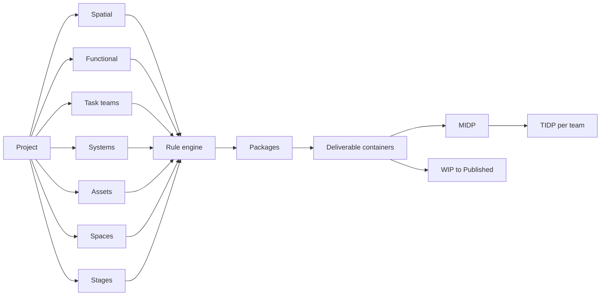
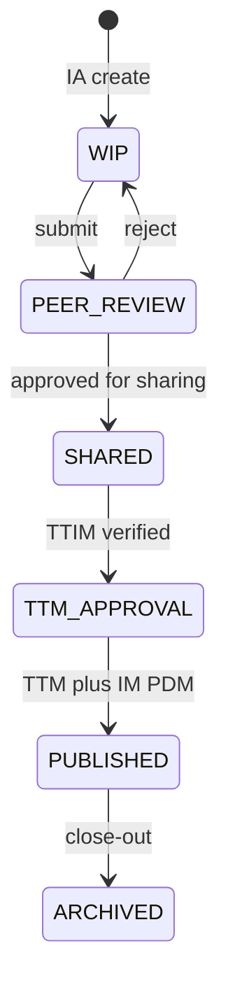
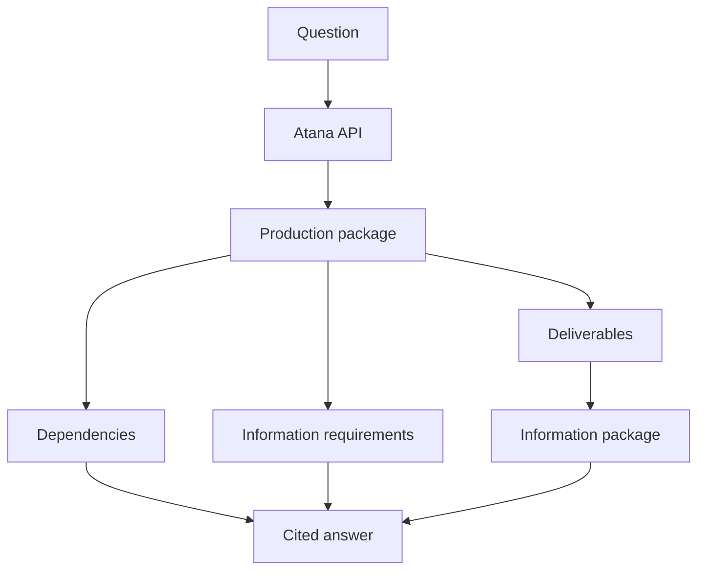
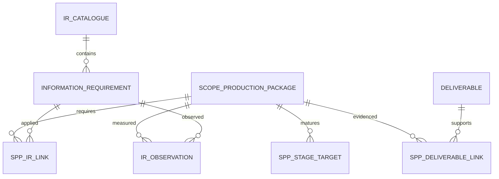
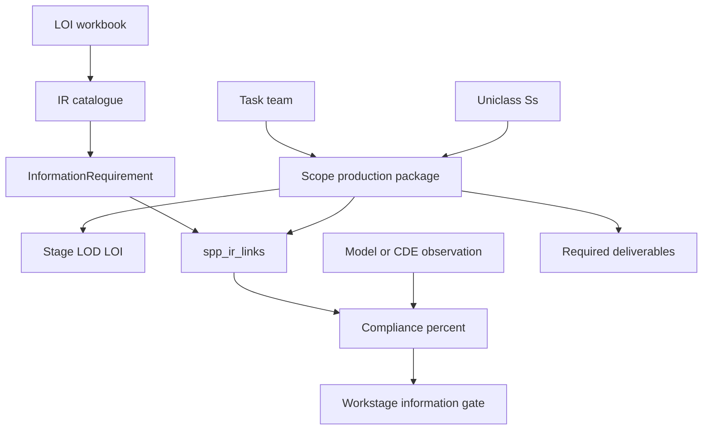
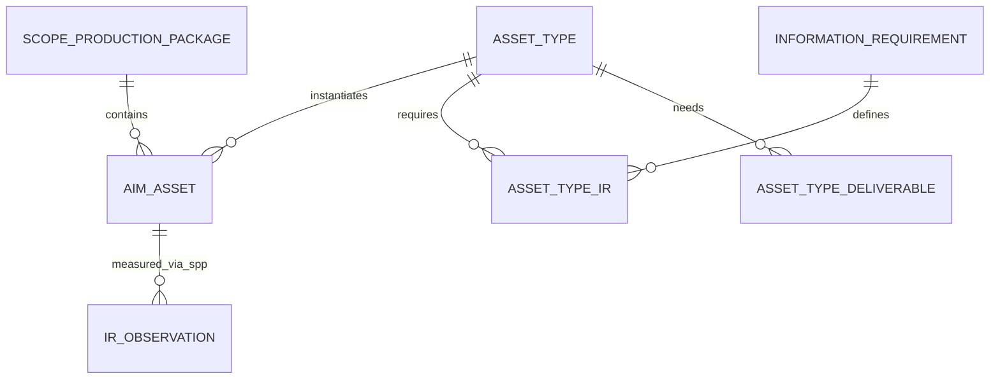
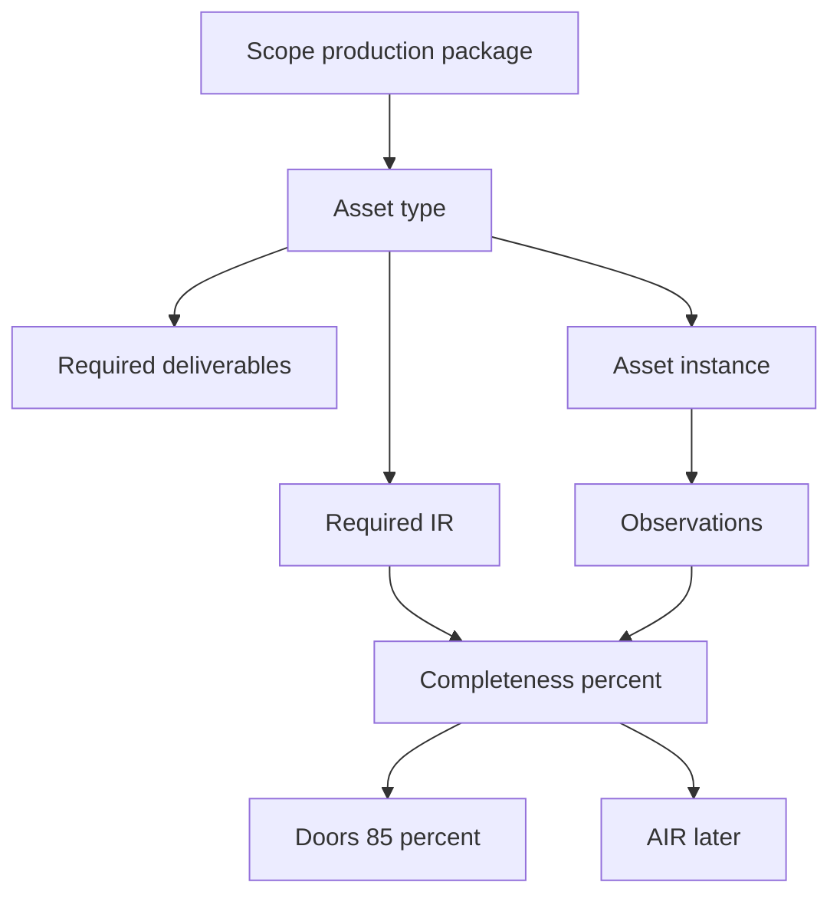

# Atana Architecture Diagrams v1.0
Paste blocks into mermaid.live or any Mermaid renderer.

## 1. Logical ERD

## 2. Rule execution

## 3. Generation workflow

## 4. ISO 19650 states

## 5. Copilot read path

## 6. Information Requirements Engine

## 7. AIM Engine

