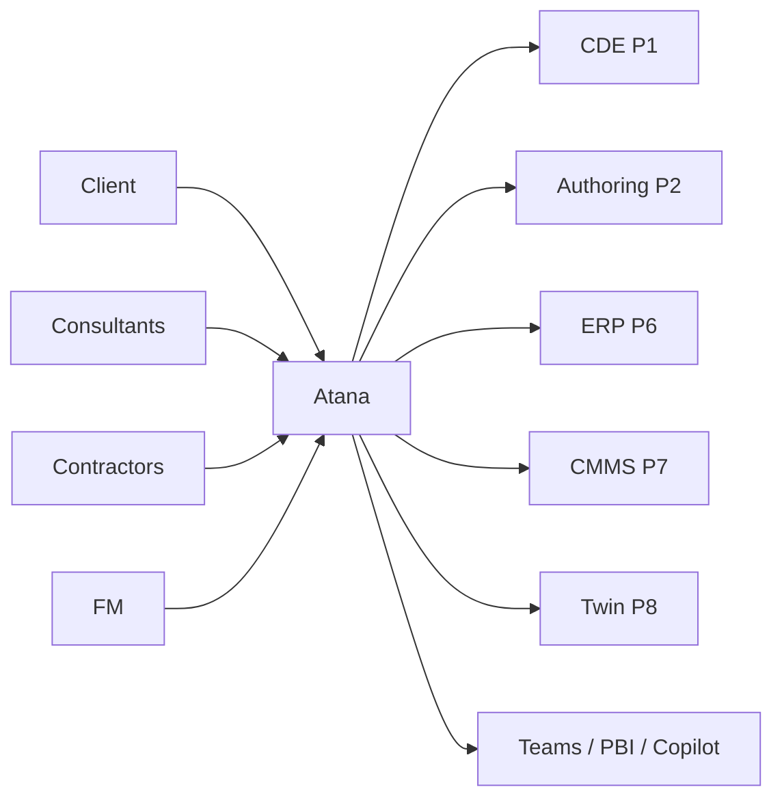
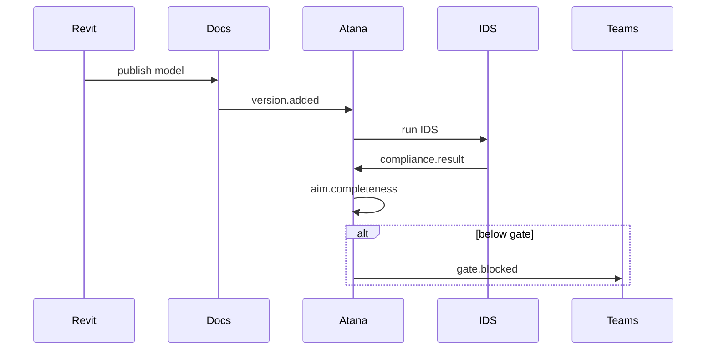

# Atana Ecosystem Architecture v1.0

**Classification:** Implementation architecture  
**Status:** Ready for Wave 1 build  
**Date:** 2026-08-31  
**Companion files:** `Atana-Ecosystem-Integrations-v1.json`, `Atana-Ecosystem-Events-v1.json`, `Atana-Ecosystem-Data-Contracts-v1.json`, `Atana-Ecosystem-API-v1.json`

This document does **not** redesign OIR, PIR, EIR, AIR, AIM, IDS, DPoW, Scope Production Packages, Information Templates, Information Requirements, Deliverables, MIDP, TIDP, workflows, compliance, the Knowledge Graph, or Decision Intelligence. Those are already the operating system.

This document answers three questions only:

1. Where does information come from?
2. Where does information go?
3. Who owns the truth?

---

## 1. Positioning

Atana is an **Information Lifecycle Operating System**.

It sits between people (client, consultants, contractors, operators, FM) and platforms (CDE, authoring tools, ERP, CMMS, twins). It does not replace Autodesk Docs, Revit, SAP, or Maximo. It decides what those systems must hold, whether they hold it, and what happens when they do not.

```
People / roles
      │
      ▼
Atana  ── System of Intelligence
      │    System of Record for requirements, plan, compliance, graph, decisions
      ▼
Adapters (event + API)
      │
      ├── CDE / files          System of Record for containers and versions
      ├── Authoring / models   System of Record for geometry and element IDs
      ├── ERP                  System of Record for commercial objects
      ├── CMMS / AM            System of Record for work orders and live asset ops
      └── Twin platforms       System of Reference for runtime state
```

The current single-file HTML tool (`Atana-IM-Tasks.html` v3.6.1) remains the **operational console**. Production runtime target is unchanged: .NET 9, PostgreSQL, Neo4j, Azure AD, Azure Service Bus / Event Grid, Azure OpenAI / AI Foundry. The HTML app consumes the same contracts; it does not become the integration runtime.

---

## 2. Four system classes

Every connected product is classified. A product may play one class only for a given entity. Dual-write of the same field is forbidden.

| Class | Meaning | Atana examples | External examples |
|---|---|---|---|
| **System of Record (SoR)** | Authoritative write for a named entity or field. Issues the durable ID. | Requirement objects, AIR rows, AIM completeness, MIDP/TIDP plan, IDS result, graph edges, decisions, actions | CDE file + revision; Revit `UniqueId`; SAP PO; Maximo work order |
| **System of Reference (SoRef)** | Trusted copy or live view. May be fresher than SoR for *state*, never for *identity*. | Published AIM snapshot issued to a twin | Digital twin telemetry; Power BI dataset; search index |
| **System of Engagement (SoE)** | Where humans act. Must not silently become SoR. | Atana workspace, Teams cards, SharePoint pages | Teams, Power Automate approvals, Procore RFIs |
| **System of Intelligence (SoI)** | Inference, ranking, recovery plans, Copilot answers. Always cites SoR. | Atana Graph + Decide + Azure AI Foundry agents | Azure OpenAI, Copilot Studio, AI Search |

### 2.1 Atana-owned SoR entities

- Organisation, Project, Portfolio, Functional / Spatial breakdown
- OIR, PIR, EIR, AIR, Information Template, Information Requirement
- Scope Production Package, Deliverable *plan* (not the binary file)
- MIDP / TIDP, workflow *state in Atana*, RACI / FRRM
- IDS specification + last compliance result
- AIM asset register *information completeness*
- Knowledge graph nodes/edges, decisions, actions, risks, recommendations
- Connector configuration, field maps, conflict records

### 2.2 External SoR (Atana never overwrites)

- File bytes, revision letter, CDE URN — CDE
- Model geometry, family, `UniqueId` / IFC GUID — authoring tool
- Cost, PO, vendor, invoice — ERP
- Work order, failure code, technician, downtime — CMMS
- Live sensor value — twin / OT historian

### 2.3 Binding rule

Identity is joined by **stable keys**, never by display name.

| Object | Binding key |
|---|---|
| Project | `atana.projectId` ↔ CDE `projectId` / SharePoint site + hub |
| Container | ISO 19650 name + CDE `lineageUrn` |
| Model element | `ifcGuid` or Revit `uniqueId` + model `containerId` |
| Asset | `atana.assetId` (SoR) tagged onto element + CMMS `assetnum` |
| Requirement | `atana.irId` / `airId` |
| Person | Entra object ID |

---

## 3. Integration architecture

### 3.1 Logical layers

1. **Experience** — Atana-IM-Tasks, Framework, Teams, Power BI, Copilot  
2. **Intelligence** — Graph, Decide, AI Foundry agents, AI Search  
3. **Domain services** — Requirements, Plan (MIDP), Compliance/IDS, AIM, Workflow, Governance  
4. **Integration fabric** — API gateway, Event Grid, Service Bus, connector workers  
5. **Adapters** — one adapter per *pattern*, many products behind it  
6. **Systems of record** — CDE, authoring, ERP, CMMS, twin

### 3.2 Eight adapter patterns

Do not build 28 unique architectures. Build eight patterns and register products onto them.

| ID | Pattern | Products |
|---|---|---|
| P1 | CDE / documents | Autodesk Docs, ACC Docs, BIM Collaborate Pro (Docs plane), SharePoint libraries, Bentley ProjectWise, Dalux, Asite, Procore documents |
| P2 | Authoring / coordination | Revit, Civil 3D, Plant 3D, Navisworks, BIM Collaborate Pro (model sync) |
| P3 | Collaboration / workflow | Microsoft Teams, Power Automate, CDE review workflows |
| P4 | Analytics | Power BI |
| P5 | Intelligence runtime | Azure AI Foundry, Azure OpenAI, Azure AI Search, Microsoft Copilot |
| P6 | ERP / commercial | Dynamics 365, SAP |
| P7 | Asset / CMMS | IBM Maximo, Hexagon EAM, Aveva APM, generic CMMS |
| P8 | Digital twin | Azure Digital Twins, vendor twin platforms |

Each product sheet in §7 fills the same twelve fields: purpose, data, direction, events, ownership, security, API, sync, master, conflict, offline, version.

### 3.3 Runtime (production)

```
Entra ID  →  APIM  →  Atana API (.NET 9)
                       ├─ PostgreSQL   (PDS — plans, IR, AIM rows, audit)
                       ├─ Neo4j        (KGE)
                       ├─ Blob / ADLS  (exports, IDS, snapshots)
                       ├─ Event Grid   (domain events)
                       ├─ Service Bus  (durable commands, retries)
                       └─ Connector workers (one process per pattern)
```

The HTML PWA talks only to Atana API (or localStorage in the current offline console). It never holds CDE or ERP secrets.

### 3.4 Multi-tenant

`tenantId` on every message and row. Connectors are scoped to a tenant + project. No cross-tenant cache keys. ACC hubs, SharePoint sites, and Maximo orgs are mapped in `connector_binding`.

---

## 4. Event architecture

All events are **CloudEvents 1.0** JSON. Transport: Azure Event Grid for fan-out, Service Bus topics for work that must not be lost.

### 4.1 Envelope

```json
{
  "specversion": "1.0",
  "id": "01J...",
  "source": "atana.compliance",
  "type": "atana.compliance.result.recorded.v1",
  "subject": "tenant/T1/project/FB01/asset/D-02",
  "time": "2026-08-31T19:00:00Z",
  "dataschema": "https://atana.local/contracts/compliance-result-v1.json",
  "datacontenttype": "application/json",
  "data": {}
}
```

### 4.2 Domain events (Atana emits)

| Type | When | Consumers |
|---|---|---|
| `atana.requirement.published.v1` | AIR / IR locked for a stage | IDS, authoring, Copilot index |
| `atana.plan.midp.generated.v1` | MIDP run committed | CDE folder ensure, Teams |
| `atana.deliverable.state.changed.v1` | WIP → Shared → Published | CDE ACL, Power BI, Decide |
| `atana.compliance.result.recorded.v1` | IDS or observation stored | Graph, Decide, AIM score |
| `atana.aim.completeness.changed.v1` | Present vs required moved | Twin snapshot, FM, exec |
| `atana.gate.blocked.v1` | Stage gate < threshold | Teams, PM, recovery plan |
| `atana.decision.raised.v1` | Action / risk created | Power Automate, D365 case |
| `atana.conflict.opened.v1` | Two SoRs disagree | IM inbox |
| `atana.mapping.failed.v1` | Adapter could not bind identity | Connector ops |

### 4.3 Foreign events (Atana consumes)

| Source | Event | Atana action |
|---|---|---|
| ACC / Docs | `version.added`, `review.closed`, `permission.changed` | Bind container, refresh state, never invent revision |
| Revit / pyRevit | `model.exported`, `parameters.pushed` | Observation ingest |
| Navisworks / BC Pro | `clash.test.completed` | Issue → graph IMPACTS |
| SharePoint | `item.updated` on governed libraries | Refresh document metadata |
| Teams / PA | `approval.completed` | Advance Atana workflow *only if* FRRM allows |
| Maximo | `workorder.completed`, `asset.updated` | Ops observation; do not change AIR |
| Twin | `telemetry.threshold` | Recommendation; AIM stays SoR for attributes |
| ERP | `wbs.changed`, `contract.activated` | Package commercial tags |

### 4.4 Delivery guarantees

- Domain events: at-least-once, idempotent consumers (`eventId` + `entityId`).
- Commands to external SoR (`cde.ensureFolder`, `revit.pushParameter`): outbox in PostgreSQL, Service Bus, exponential retry, poison queue after 8.
- Webhooks inbound: signature + timestamp, store raw payload 14 days, map asynchronously.

### 4.5 Webhook design

Atana exposes `POST /v1/hooks/{connectorId}` per binding. Challenge handshake for ACC and Graph. Each connector verifies vendor signature. Payload is not trusted as SoR until the adapter maps it through the data contract.

Outbound webhooks for partners: subscribe to event types, HMAC secret per subscription, 3s timeout, retry 1/5/30/120 minutes.

---

## 5. Data contracts

Canonical payloads live in `Atana-Ecosystem-Data-Contracts-v1.json`. Rules:

- Atana IDs are ULID/UUID. External IDs are opaque strings in `external[]`.
- Every payload has `tenantId`, `projectId`, `schemaVersion`.
- Files are referenced by URI + hash + revision. Bytes stay in the CDE.
- Observations carry `loi`, `present`, `value`, `sourceSystem`, `observedAt`.
- Completeness is always `present / required` at a named LOI — never “feels complete”.

### 5.1 Core contracts

| Contract | Producer | Consumer |
|---|---|---|
| `ProjectBinding` | Atana | All adapters |
| `ContainerRef` | CDE adapter | Plan, workflow |
| `DeliverablePlan` | Atana DGE | CDE ensure-folder |
| `RequirementSpec` | AIR / IR services | IDS, Revit shared params |
| `Observation` | Authoring / CDE / CMMS | Compliance, AIM |
| `ComplianceResult` | IDS worker | Graph, Decide, gate |
| `AssetRecord` | AIM service | Twin, CMMS map |
| `DecisionAction` | Decide | Teams, PA, ERP case |
| `ConflictRecord` | Any adapter | IM |

### 5.2 Master data strategy

| Domain | Master | Propagates as |
|---|---|---|
| Parties, roles, Entra users | Entra + Atana role map | SoRef to CDE permission jobs |
| Classification (Uniclass Ss/SL/Pr) | Atana catalogue | SoRef to Revit / naming |
| Shared parameters | Atana + `ATA_ZZ_SharedParameters` | Pushed to Revit; CDE custom attributes optional |
| Asset identifier | Atana AIM `assetId` | Written *once* onto element + CMMS |
| File revision | CDE | Read-only in Atana |
| Stage / gate threshold | Atana project settings | Read-only elsewhere |
| Cost / vendor | ERP | Tag on package, never inverted |

Catalogue precedence already defined: USER > ASSET > PROJECT > ORGANISATION > SYSTEM. Connectors do not invent a sixth layer.

---

## 6. API contracts

Public surface is versioned under `/v1`. GraphQL at `/graphql` is read-mostly for the Knowledge Graph (production). REST is the integration surface.

### 6.1 Security model (all APIs)

- Entra ID (OIDC) user tokens for people.
- App registration + client credentials for connectors.
- Scopes: `atana.read`, `atana.plan.write`, `atana.compliance.write`, `atana.aim.write`, `atana.admin`.
- Project-level authorisation using existing roles: IA, PR, TTIM, TTM, DTL, PDM, IM, DM, ORGADMIN, SYSADMIN.
- Field-level: connectors may write only mapped fields. AIR values authored in Revit are observations until IM accepts them as AIM.
- Audit: who, when, why, old, new — already in the governance framework.
- PII: names and emails from Entra; not copied into twin telemetry streams.
- Secrets: Azure Key Vault. None in the HTML file.

### 6.2 Representative routes

| Method | Path | Purpose |
|---|---|---|
| GET | `/v1/projects/{id}/bindings` | External system maps |
| PUT | `/v1/projects/{id}/bindings/{connector}` | IM / admin |
| GET | `/v1/projects/{id}/midp` | Plan SoR |
| POST | `/v1/projects/{id}/midp/generate` | Already specified in DGE |
| GET | `/v1/projects/{id}/containers` | Joined plan + CDE refs |
| POST | `/v1/observations` | Idempotent upsert |
| POST | `/v1/ids/runs` | Kick IDS against a container |
| GET | `/v1/aim/assets/{id}` | Completeness + bindings |
| GET | `/v1/graph/why/{nodeId}` | Reverse trace |
| GET | `/v1/graph/impact/{nodeId}` | Forward BFS |
| POST | `/v1/ask` | Copilot / Decide (`atnAnswer` contract) |
| GET | `/v1/conflicts` | Open mapping disputes |
| POST | `/v1/hooks/{connectorId}` | Inbound webhook |

Idempotency key header: `Idempotency-Key`. Pagination: cursor. Errors: RFC 7807.

---

## 7. Product integrations

Shared defaults unless a row overrides them:

- **Security:** Entra or vendor OAuth; secrets in Key Vault; least privilege; tenant + project scope.
- **Offline:** queue locally (pyRevit / PWA), flush when online; no silent SoR writes.
- **Version:** contract `schemaVersion`; vendor API version pinned in binding; Atana never clones CDE revision letters.
- **Conflict:** domain field map; conflicting write → `ConflictRecord`; human IM resolves; no last-write-wins on requirements.
- **Sync:** events first, nightly reconcile second, on-demand third.

### 7.1 Autodesk Construction Cloud (hub)

| Field | Design |
|---|---|
| Purpose | Programme hub: projects, members, Docs, Issues, Model Coordination. |
| Data | Projects, members, Docs URNs, issues, review cycles, model sets. |
| Direction | CDE SoR → Atana SoRef for files/issues. Atana → ACC for issue *from gate* and custom attributes that copy AIR status. |
| Events | `version.added`, `review.closed`, `issue.created`. |
| Ownership | ACC owns files and ACC issues. Atana owns whether the file satisfies a deliverable plan row. |
| API | APS (Data Management, Issues, Webhooks, Admin). 3-legged for user; 2-legged for daemon where permitted. |
| Sync | Webhook → adapter → `ContainerRef` / `Observation`. Nightly tree walk for drift. |
| Master | File version: ACC. Deliverable requiredness: Atana. |
| Conflict | ACC renamed file that breaks ISO name → conflict, do not auto-rename unless policy `naming.enforce=true`. |
| Offline | No. Hub is online-only. |
| Version | Pin APS versions on the binding. |

### 7.2 Autodesk Docs

| Field | Design |
|---|---|
| Purpose | ISO 19650 container store (WIP / Shared / Published / Archive). |
| Data | Folders, items, versions, naming, reviews, permissions. |
| Direction | Docs → Atana: version + state. Atana → Docs: ensure folder skeleton from MIDP; permission hints. |
| Events | Same Docs webhooks as ACC. |
| Ownership | Docs = file SoR. Atana = plan + compliance SoR. |
| API | Data Management + Folders + Webhooks. |
| Sync | On publish event, bind by ISO name tokens (project, originator, FB, spatial, form, number). |
| Master | Revision letter and bytes: Docs. Required container list: Atana MIDP. |
| Conflict | Two files claim the same ISO number → conflict. |
| Offline | Desktop Connector cache is not SoR. |
| Version | Item version lineage is the only accepted history. |

### 7.3 Revit

| Field | Design |
|---|---|
| Purpose | Author geometry and typed parameters that satisfy AIR / templates. |
| Data | `UniqueId`, category, type, shared parameters (`ATA_ZZ_*`), rooms, levels. |
| Direction | Atana → Revit: required parameter definition + IDS expectations (pyRevit / shared parameter file). Revit → Atana: observations and IFC/GUID map. |
| Events | `model.saved` (local), `model.published` (to Docs), pyRevit `parameters.pushed`. |
| Ownership | Geometry SoR = Revit. Parameter *requirement* SoR = AIR. Parameter *value* = observation until accepted into AIM. |
| API | pyRevit scripts already in repo; APS Design Automation later for unattended runs. |
| Sync | On publish to Docs + user “Push to Atana”. |
| Master | Element id: Revit. Asset id: Atana (written into a reserved parameter). |
| Conflict | Value in model ≠ accepted AIM value → conflict, show both. |
| Offline | pyRevit queues JSON; flush on next online push. |
| Version | Model version = CDE version of the host file. |

### 7.4 Navisworks

| Field | Design |
|---|---|
| Purpose | Coordination tests that evidence design maturity. |
| Data | Clash tests, results, viewpoint refs, grouped issues. |
| Direction | Navis → Atana observations / issues. Atana → Navis: test pack names aligned to packages. |
| Events | `clash.test.completed`. |
| Ownership | Clash result SoR = Navis/BC Pro. Whether it blocks a gate = Atana rule. |
| API | NWD/XML export now; APS Model Coordination when on BC Pro. |
| Sync | On test complete or nightly. |
| Master | Clash id: Navis. Gate impact: Atana. |
| Conflict | Recurring clash after “accepted risk” → new observation, do not delete the decision. |
| Offline | File-based export supported. |
| Version | Test run timestamped; previous runs retained. |

### 7.5 Civil 3D

| Field | Design |
|---|---|
| Purpose | Site / infrastructure authoring for civil packages. |
| Data | Alignments, surfaces, corridors, COGO, property sets. |
| Direction | Same as Revit pattern (P2). |
| Events | DWG published to Docs. |
| Ownership | Civil geometry SoR = Civil 3D. IR for site assets = Atana. |
| API | Property sets + exports; Design Automation later. |
| Sync | On publish. |
| Master | Handle / handle+GUID. Asset id from Atana for handover objects (e.g. chambers). |
| Conflict | Same observation rule as Revit. |
| Offline | Queue exports. |
| Version | CDE version of DWG. |

### 7.6 Plant 3D

| Field | Design |
|---|---|
| Purpose | Process plant authoring; spec-driven assets. |
| Data | P&ID tags, 3D line numbers, spec, insulation, valves. |
| Direction | Plant → Atana asset observations. Atana → Plant: required properties from AIR. |
| Events | Publish isometric / model to CDE. |
| Ownership | Tag uniqueness often Plant/Aveva world — if Plant is designated tag SoR for that project, Atana stores it as external id. |
| API | Data Manager / reports / CSV now; APIs where licensed. |
| Sync | Scheduled extract + publish event. |
| Master | Project setting `tagMaster = plant3d | atana`. Default Atana for building projects, Plant for process. |
| Conflict | Duplicate tags → conflict, block AIM accept. |
| Offline | Report dump. |
| Version | Drawing + spec version. |

### 7.7 BIM Collaborate Pro

| Field | Design |
|---|---|
| Purpose | Live model consumption, packs, coordination. |
| Data | Consumed models, packages, coordination issues. |
| Direction | BC Pro → Atana for consumption graph and issues. Atana → teams via plan (who must consume what). |
| Events | Package published, consumption outdated. |
| Ownership | Consumption state SoR = BC Pro. Required consumption = Atana package dependencies. |
| API | APS Model Coordination + Packets where available. |
| Sync | Event + hourly drift. |
| Master | “Is the architect consuming latest MEP?” — BC Pro fact, Atana rule. |
| Conflict | Plan says consume X, BC Pro has Y → conflict. |
| Offline | No. |
| Version | Model set version. |

### 7.8 SharePoint

| Field | Design |
|---|---|
| Purpose | Enterprise document SoE/SoR for BEP, appointments, non-CDE registers. |
| Data | Sites, libraries, columns, pages, lists. |
| Direction | Configurable per library: `mode=reference` (default) or `mode=sor` for named enterprise docs. |
| Events | Graph change notifications. |
| Ownership | Default SoRef. SoR only when binding says so (e.g. contract library). |
| API | Microsoft Graph. |
| Sync | Delta query + webhooks. |
| Master | Declared per library in binding. |
| Conflict | If library is SoRef, SharePoint edits do not change Atana requirements. |
| Offline | OneDrive sync is not SoR. |
| Version | SharePoint version when it is SoR; otherwise ignore. |

### 7.9 Microsoft Teams

| Field | Design |
|---|---|
| Purpose | System of Engagement: gate alerts, approvals, Copilot answers in channel. |
| Data | Adaptive cards, chat, meeting artefacts (links only). |
| Direction | Atana → Teams notifications. Teams → Atana approval completions via PA. |
| Events | `atana.gate.blocked`, `atana.decision.raised`. |
| Ownership | Message is not a record. Decision lives in Atana. |
| API | Graph + incoming webhooks / bot. |
| Sync | Push only. |
| Master | Atana. |
| Conflict | None. Duplicate cards suppressed by `eventId`. |
| Offline | Card waits in outbox. |
| Version | Card schema versioned. |

### 7.10 Power Automate

| Field | Design |
|---|---|
| Purpose | Customer-owned orchestration without forking Atana. |
| Data | Connector triggers on Atana events; actions call Atana API. |
| Direction | Event → flow → allowed write scopes only. |
| Events | All public domain events. |
| Ownership | Flow owner is tenant IT; cannot bypass FRRM. |
| API | Custom connector wrapping `/v1`. |
| Sync | Event-driven. |
| Master | Unchanged. |
| Conflict | Flow write that violates map → 409 + conflict. |
| Offline | PA retries. |
| Version | Connector versioned with API. |

### 7.11 Power BI

| Field | Design |
|---|---|
| Purpose | Portfolio and project reporting SoE. |
| Data | Semantic model: health, gates, AIM %, package status, conflicts. |
| Direction | Atana → PBI only. |
| Events | Nightly dataset refresh + on `aim.completeness.changed` for premium. |
| Ownership | Dataset is SoRef. Measures must match Atana formulas (`present/required`). |
| API | Export APIs + warehouse views. |
| Sync | Incremental refresh on `updatedAt`. |
| Master | Atana. |
| Conflict | None (read-only). |
| Offline | Cached report. |
| Version | Dataset version = contract version. |

### 7.12 Azure AI Foundry

| Field | Design |
|---|---|
| Purpose | Host multi-agent runtime later (parked product work). Ecosystem slot reserved. |
| Data | Tool calls against Atana API; no private weights as SoR. |
| Direction | Foundry ↔ Atana tools. |
| Events | Agent run started/finished (ops). |
| Ownership | Answers are SoI. Must cite graph nodes. |
| API | Foundry agents + Atana tool surface (`/v1/ask`, `/v1/graph/*`). |
| Sync | Synchronous tool calls. |
| Master | Atana domain data. |
| Conflict | Agent must not write AIM without IM scope. |
| Offline | Degrade to local `atnAnswer` in the HTML tool. |
| Version | Prompt + tool schema versioned. |

### 7.13 Azure OpenAI

| Field | Design |
|---|---|
| Purpose | LLM behind Decide / Copilot. |
| Data | Grounded context from graph + contracts; no training on tenant data unless contract says so. |
| Direction | Atana service → AOAI → Atana (never client → AOAI with project data). |
| Events | Token usage metrics. |
| Ownership | SoI only. |
| API | Azure OpenAI, private network. |
| Sync | Request/response. |
| Master | n/a. |
| Conflict | n/a. |
| Offline | Local rule answers in v3.6.1 Graph/Decide. |
| Version | Deployment name pinned. |

### 7.14 Azure AI Search

| Field | Design |
|---|---|
| Purpose | Retrieval over published containers metadata + IR text + decisions. |
| Data | Index is SoRef. |
| Direction | Atana → index. |
| Events | On publish and on requirement publish. |
| Ownership | Search index rebuildable from SoR at any time. |
| API | Azure AI Search. |
| Sync | Push on event + weekly full rebuild. |
| Master | Atana + CDE metadata. |
| Conflict | Index stale ≠ conflict; freshness SLO 15 minutes for published. |
| Offline | Graph tab still works locally. |
| Version | Index schema versioned. |

### 7.15 Microsoft Copilot

| Field | Design |
|---|---|
| Purpose | SoE in M365. Grounded on Atana connector, not raw CDE dump. |
| Data | Same `/v1/ask` answers. |
| Direction | Copilot → Atana plugin → answer. |
| Events | Plugin invocation log. |
| Ownership | Atana SoI. |
| API | Copilot plugin / Graph connector. |
| Sync | Live. |
| Master | Atana. |
| Conflict | n/a. |
| Offline | Falls back to Atana app. |
| Version | Plugin manifest version. |

### 7.16 Dynamics 365

| Field | Design |
|---|---|
| Purpose | Commercial SoR: opportunities, projects, change orders, cases. |
| Data | Project codes, WBS, changes, customer. |
| Direction | D365 → Atana tags on project/package. Atana → D365 case when `gate.blocked` and policy on. |
| Events | `contract.activated`, `change.approved`. |
| Ownership | Money SoR = D365. Information gate SoR = Atana. |
| API | Dataverse. |
| Sync | Event + daily. |
| Master | Project commercial code: D365. `atana.projectId` remains IM master. |
| Conflict | Code rename → remap, do not fork project. |
| Offline | No commercial writes offline. |
| Version | Dataverse row version. |

### 7.17 SAP

| Field | Design |
|---|---|
| Purpose | Same as D365 where SAP is the ERP. |
| Data | WBS, vendors, materials, settlement. |
| Direction | SAP → Atana tags. Atana does not write FI documents. |
| Events | IDoc / Event Mesh WBS and PO. |
| Ownership | SAP commercial SoR. |
| API | BTP Event Mesh + OData APIs. |
| Sync | Event + nightly. |
| Master | SAP object numbers. |
| Conflict | Closed WBS still referenced by package → conflict, freeze package commercial tag. |
| Offline | No. |
| Version | SAP change docs. |

### 7.18 IBM Maximo

| Field | Design |
|---|---|
| Purpose | Work management SoR after handover. |
| Data | `assetnum`, locations, job plans, work orders, failure codes. |
| Direction | Atana AIM → Maximo asset create/update *on accepted handover*. Maximo → Atana ops observations. |
| Events | `asset.updated`, `workorder.completed`. |
| Ownership | Work order SoR = Maximo. Required operating information = AIR/AIM. |
| API | Maximo MAS / REST OSI. |
| Sync | Handover job (once per asset) + incremental WO. |
| Master | `atana.assetId` stored in Maximo classification / spec; `assetnum` stored on AIM. |
| Conflict | Maximo attribute vs AIM accepted value → conflict, ops may be newer (policy `opsWinsAfterHandover`). |
| Offline | Maximo mobile is Maximo’s problem. |
| Version | Asset + WO revisions in Maximo. |

### 7.19 Hexagon

| Field | Design |
|---|---|
| Purpose | Plant / owner operator EAM or HxGN SDx as information warehouse. |
| Data | Tags, documents, plant breakdown. |
| Direction | Same P7/P8 hybrid. Binding declares whether Hexagon is tag SoR. |
| Events | Document issue, tag change. |
| Ownership | Declared per project. |
| API | Product-specific (SDx / EAM). |
| Sync | Event where licensed, else extract. |
| Master | Binding `tagMaster`. |
| Conflict | Tag clash with Plant 3D / Atana. |
| Offline | Extract files. |
| Version | Plant revision scheme. |

### 7.20 Aveva

| Field | Design |
|---|---|
| Purpose | Engineering + APM on process assets. |
| Data | Tags, 3D, isometrics, APM health. |
| Direction | Engineering extracts → observations. APM telemetry → SoRef. |
| Events | Issue-for-construction, APM alerts. |
| Ownership | If Aveva is engineering SoR for tags, Atana binds; AIM still owns completeness vs AIR. |
| API | NET / APM APIs as licensed. |
| Sync | Milestone + alert. |
| Master | Binding. |
| Conflict | Same tag policy as Plant 3D. |
| Offline | Data dumps. |
| Version | Aveva project revision. |

### 7.21 Bentley ProjectWise

| Field | Design |
|---|---|
| Purpose | CDE alternative / additional (P1). |
| Data | Documents, versions, workflows, attributes. |
| Direction | Identical CDE pattern to Docs. |
| Events | Check-in, state change. |
| Ownership | PW = file SoR for bound projects. |
| API | ProjectWise Web / WSG. |
| Sync | Event + reconcile. |
| Master | PW version. Plan = Atana. |
| Conflict | Dual-CDE projects require `primaryCde` on binding. Never two file SoRs. |
| Offline | PW Explorer cache not SoR. |
| Version | PW version ID. |

### 7.22 Dalux

| Field | Design |
|---|---|
| Purpose | Field / CDE SoE+SoR depending on client. |
| Data | Drawings, checklists, snags, FM handover packs. |
| Direction | Dalux snags → Atana issues/observations. Atana AIM → Dalux FM if chosen. |
| Events | Snag created/closed, drawing published. |
| Ownership | Field snag SoR = Dalux unless project says otherwise. |
| API | Dalux API. |
| Sync | Event / poll 15 min. |
| Master | Binding `primaryCde` if Dalux is the CDE. |
| Conflict | Dual publish to Docs and Dalux — pick one file SoR. |
| Offline | Dalux app offline is vendor-owned. |
| Version | Dalux revision. |

### 7.23 Asite

| Field | Design |
|---|---|
| Purpose | CDE (common on UK / ISO 19650 programmes). |
| Data | Containers, workflow, distribution. |
| Direction | P1 CDE pattern. |
| Events | Issue, approval, publish. |
| Ownership | Asite file SoR when primary. |
| API | Asite open APIs. |
| Sync | Webhook + nightly. |
| Master | Asite revision. |
| Conflict | Naming vs MIDP. |
| Offline | No Atana write. |
| Version | Asite revision. |

### 7.24 Procore

| Field | Design |
|---|---|
| Purpose | Contractor SoE: RFIs, submittals, drawings. |
| Data | RFIs, submittals, drawings, observations. |
| Direction | Procore → Atana as observations/issues. Atana does not become the contractor PM tool. |
| Events | RFI closed, spec section uploaded. |
| Ownership | RFI SoR = Procore. Whether it blocks an information gate = Atana. |
| API | Procore REST. |
| Sync | Webhooks. |
| Master | Procore ids stored as external. |
| Conflict | Drawing set in Procore ≠ published CDE set → conflict if both bound. |
| Offline | Vendor mobile. |
| Version | Procore item number + revision. |

### 7.25 Generic CMMS

| Field | Design |
|---|---|
| Purpose | Same P7 as Maximo when the owner uses another CMMS. |
| Data | Asset, location, WO, PM schedule. |
| Direction | AIM accept → create asset. WO complete → observation. |
| Events | Asset, WO. |
| Ownership | WO SoR = CMMS. |
| API | Adapter interface `ICmmSAdapter`. |
| Sync | Handover + incremental. |
| Master | Dual keys as Maximo. |
| Conflict | `opsWinsAfterHandover` policy. |
| Offline | n/a. |
| Version | Vendor. |

### 7.26 Digital twin platforms

| Field | Design |
|---|---|
| Purpose | Runtime SoRef for live entities. AIM remains the information SoR. |
| Data | Twin graph, telemetry, alerts. |
| Direction | Accepted AIM snapshot → twin. Telemetry → recommendations only. |
| Events | Alert, disconnect. |
| Ownership | Twin owns live values. Atana owns required properties and identity. |
| API | Azure Digital Twins / vendor. |
| Sync | On AIM accept and on stage close-out. |
| Master | `atana.assetId` = twin `$dtId` prefix. |
| Conflict | Telemetry vs AIM nameplate — nameplate stays AIM. |
| Offline | Twin runtime independent. |
| Version | Twin model (DTDL) versioned with AIR template version. |

---

## 8. Lifecycle data flow

```
Need (OIR/PIR/EIR)
        → AIR / templates / IR
        → MIDP / packages / containers
        → Authoring (Revit / Civil / Plant)
        → CDE states (WIP Shared Published)
        → IDS / observations
        → AIM present vs required
        → Gate (Stage 4 95% default)
        → Handover snapshot
        → CMMS + Twin
        → Operations observations
        → Lessons → catalogue (not silent mutation of AIR)
```

At every arrow: an event, a contract, a master, an owner.

Stage 4 example (already seeded as Fire Rating walk):

1. OIR “safe building” generates PIR “compartmentation known”.
2. EIR binds AIR “Fire Rating on every door”.
3. Template Door contains attribute Fire Rating → IDS.
4. Revit parameter `ATA_ZZ` Fire Rating captured on D-01 / missing on D-02.
5. Publish to Docs raises `version.added`.
6. IDS run records fail on D-02.
7. AIM completeness < 95% → `gate.blocked`.
8. Decide emits action “Capture Fire Rating on D-02”.
9. Teams card to Information Author.
10. On pass, AIM accept; later Maximo + twin receive D-02.

---

## 9. Enterprise service model

Capability groups (stable even when products change):

| Capability | Service | SoR |
|---|---|---|
| Identity & access | Entra + Atana RBAC | Entra users, Atana roles |
| Requirements | Requirements service | Atana |
| Plan | DGE / MIDP service | Atana |
| Containers | CDE adapter | CDE files, Atana plan |
| Compliance | IDS / observation service | Atana results |
| Assets | AIM service | Atana completeness, CMMS work |
| Graph | KGE | Atana |
| Decisions | Decide | Atana |
| Intelligence | AI Foundry + AOAI | SoI only |
| Integration | Fabric + adapters | Bindings in Atana |

---

## 10. Security model (ecosystem)

- Zero secrets in `Atana-IM-Tasks.html`.
- Conditional access for staff; managed identity for workers.
- Separate app registrations per pattern (compromise of PBI does not yield Maximo write).
- Data residency: tenant setting; default region of the Atana resource group.
- Encryption: TLS 1.2+, CMEK optional on PostgreSQL and blobs.
- Supplier access: time-boxed project roles; no catalogue admin.
- Audit export to customer SIEM (Event Grid subscription).

---

## 11. Conflict, offline, version — platform rules

**Conflict resolution order**

1. Field map says which system may write the field.
2. If two writes land, open `ConflictRecord`; keep both values.
3. IM (or designated role) accepts one; the other is archived, not deleted.
4. After handover, policy may set `opsWinsAfterHandover=true` for operating fields only.

**Offline**

- PWA and pyRevit may capture observations.
- Flush is idempotent.
- No offline mutation of AIR, catalogues, or gate thresholds.

**Version handling**

- Contracts: additive semver. Breaking change = new `type` suffix `.v2`.
- CDE revisions: never rewritten.
- AIM snapshot at each accepted gate is immutable (`aimSnapshotId`).

---

## 12. Implementation roadmap

Parked product work stays parked: live ACC write-back in the HTML file, live twin, multi-agent, executive command center UI.

| Wave | When | What | Exit criterion |
|---|---|---|---|
| 0 | Done | HTML IM tool + in-memory KGE 3.6.1 | Graph/Decide answers Fire Rating walk |
| 1 | Next build | Bindings API + Event envelope + ACC/Docs **read** + SharePoint **read** | Container list shows CDE version next to MIDP row |
| 2 | | Revit pyRevit observation push + IDS run store | D-02 missing Fire Rating appears from model, not seed only |
| 3 | | Teams + Power Automate + Power BI views | Gate card + dataset match Atana % |
| 4 | | Maximo / CMMS handover adapter | Accepted AIM creates asset with dual keys |
| 5 | | Twin snapshot + AI Foundry tools | Twin `$dtId` = asset id; Copilot cites graph |

No Wave 1 item writes bytes into a CDE unless IM enables `naming.enforce` on that project.

---

## 13. Diagram index

Mermaid sources also live in `Atana-Architecture-Diagrams-v1.md` (internal ERD / DGE). Ecosystem diagrams:

### 13.1 Context



### 13.2 Event map (Stage 4 publish)



### 13.3 Capability map

Requirements → Plan → Author → Store → Check → Accept → Operate → Learn.

---

## 14. What this deliberately is not

- Not a rebuild of AIR / AIM / MIDP.
- Not a mandate to implement all 26 products in Wave 1.
- Not last-write-wins integration.
- Not putting Autodesk or SAP credentials in the PWA.

Wave 1 implements the fabric and one CDE + one authoring path. Everything else reuses the same contracts.
